# 🚀 TechHaven

> TechHaven is a .NET 9 ASP.NET Core e‑commerce web application for PC components, featuring a public catalog, shopping cart, wishlist, order management with status tracking, and a role-protected admin area for product and order administration.


---
## 📋 Table of Contents

- [About the Project](#about-the-project)
- [Technologies Used](#technologies-used)
- [Prerequisites](#prerequisites)
- [Getting Started](#getting-started)
- [Project Structure](#project-structure)
- [Features](#features)
- [Usage](#usage)
- [Database Setup](#database-setup)
- [Configuration](#configuration)
- [Contributing](#contributing)
- [License](#license)
- [Contact](#contact)

---

## 📖 About the Project

TechHaven is an e‑commerce platform built with ASP.NET Core 9 and Razor Views.
It demonstrates a layered architecture with clean separation of concerns: controllers handle requests, services implement business logic, and EF Core manages persistence.

Users can browse categories and products, add items to their cart or wishlist, and place orders. Admin users can manage products, view orders, and toggle product availability.

It’s built as a showcase project for learning and demonstrating .NET web application patterns.

---

## 🛠️ Technologies Used

| Technology            | Version  | Purpose                            |
|-----------------------|----------|----------------------------------- |
| ASP.NET Core MVC      | 9.0      | Web framework                      |
| Entity Framework Core | 8.0      | ORM / Database access (code-first) |
| SQL Server / SQLite   | -        | Database                           |
| Bootstrap             | 5.3      | Frontend styling                   |
| Razor Pages / Views   | -        | Server-side HTML rendering         |
| TypeScript            | 5.9      | Dynamic UI updates                 |

---

## ✅ Prerequisites

Make sure you have the following installed before running the project:

- [.NET SDK 9.0+](https://dotnet.microsoft.com/download)
- [Visual Studio 2022](https://visualstudio.microsoft.com/) or [VS Code](https://code.visualstudio.com/)
- [SQL Server](https://www.microsoft.com/en-us/sql-server)
- [Node.js & npm](https://nodejs.org/en) for TypeScript compilation
- [Git](https://git-scm.com/)

---

## 🚀 Getting Started

Follow these steps to get the project running locally.

### 1. Clone the repository

```bash
git clone https://github.com/mxrt0/TechHaven.git
cd TechHaven
```

### 2. Restore .NET dependencies

```bash
dotnet restore
```

### 3. Apply database migrations

```bash
dotnet ef database update
```
// OR in Package Manager Console:

```bash
Update-Database
```

### 4. Compile TypeScript assets

```bash
cd wwwroot
npm install
npx tsc -p tsconfig.json
cd ..
```

### 5. Run the application

```bash
dotnet run
```

The app will be available at `https://localhost:7235` or `http://localhost:5150`.

---

## 📁 Project Structure

```
TechHaven/
│
├── Controllers/                  # MVC Controllers for public site
├── Areas/Admin/                  # Admin Area 
|   ├── Controllers/              # Admin MVC controllers
│   ├── ViewModels/               # View Models for admin
│   └── Views/                    # Admin Razor Views
├── Areas/Identity/Pages/Account/ # Razor pages for Identity (Register, Login, Logout)
├── Models/                       # View Models for public site
├── Data/                         # DbContext
|   ├── Configuration/            # Entity configurations
│   ├── Migration/                # Migrations
│   └── Models/                   # EF Core Entities
├── Services/                     # Business logic / service layer
│   ├── Contracts/                # Service interfaces
|   |   ├── Public/               # Public service contracts
│   |   └── Admin/                # Admin service contracts
│   ├── Public/                   # Public-facing services
│   └── Admin/                    # Admin services
├── DTOs/                         # Data Transfer Objects
|   ├── Public/                   # Public-facing DTOs
│   └── Admin/                    # Admin DTOs
├── Views/                        # Razor Views for public site
├── wwwroot/                      # Static assets
│   ├── ts/                       # TypeScript source scripts (cart, wishlist, toast, orders)
│   ├── js/                       # Compiled JS
│   └── css/                      # CSS styles
├── appsettings.json              # Application configuration
└── Program.cs                    # App startup, Identity configuration, DI, middleware, admin seeder
```

---

## ✨ Features

### General

- [ ] Responsive UI with Bootstrap
- [ ] Toast-based notifications

### Public Site

- **Product Catalog**
  - Browse products by category.
  - Search, filter, and paginate product listings.
  - View detailed product pages including images and structured JSON-based specifications.

- **Shopping Cart**
  - Cookie-based cart system.
  - Add/remove products to cart.  
  - Checkout flow with order creation.

- **Wishlist**
  - Authenticated users can add/remove wishlist items.
  - Separate controller and frontend logic for wishlist management.

- **Orders**
  - View order details.
  - Track **order status** (Pending, Shipped, Cancelled).
  - Cancel orders.

### Admin Area

- **Product Management**
  - Create, read, update, and delete (CRUD) products.
  - Toggle product availability.
  - Search, filter, sort, and paginate product listings.

- **Order Management**
  - View all orders and order details.
  - Track and update **order status**.

### Identity & Security

- User registration, login, logout (ASP.NET Identity).
- Admin role seeded on startup.
- Password policy relaxed for development; 
- 5-minute lockout enabled after 5 failed attempts.

---

## 💻 Usage

### Public Site

1. Navigate to the register page via the 'Register' button in the bottom left to create an account.
2. Log in via the 'Login' button above 'Register'.

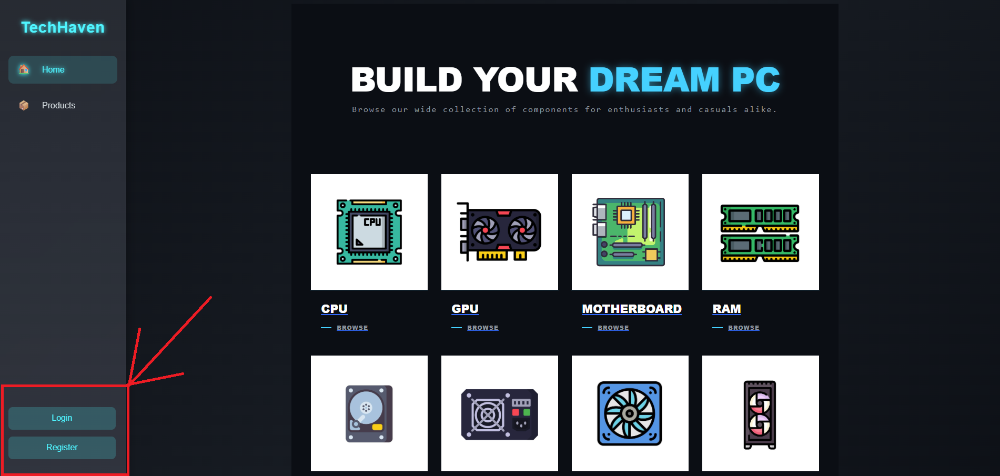

3. Browse categories and view products in the catalog by following one of the category links on the home page or the Products navigation link on the left.

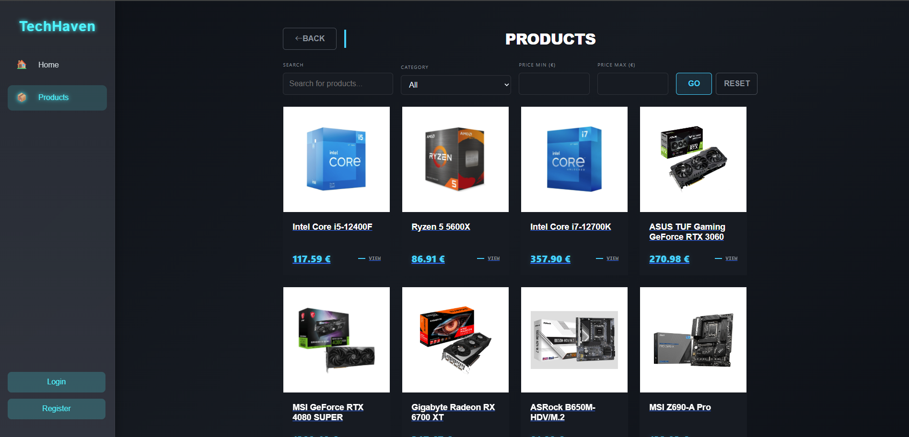

4. View and Add products to your cart via the provided buttons.

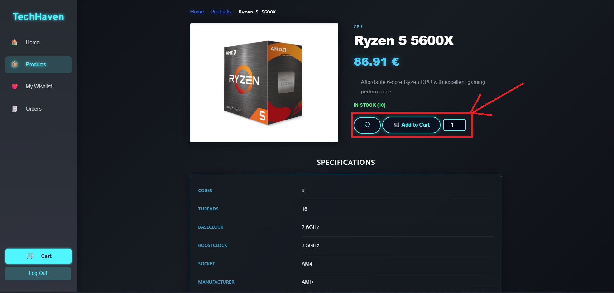

5. Navigate to the cart via the button on the bottom left above 'Log Out'.

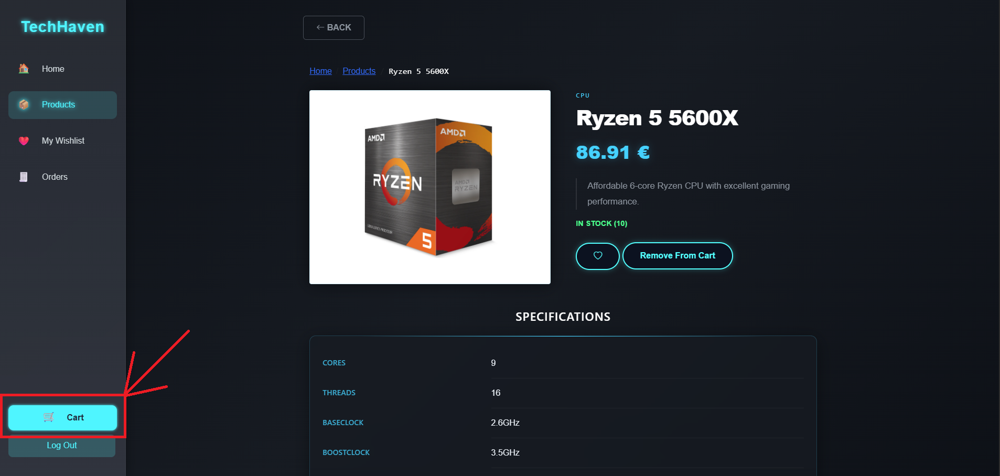

6. Update product quantities or remove items if desired and proceed to checkout to place an order.

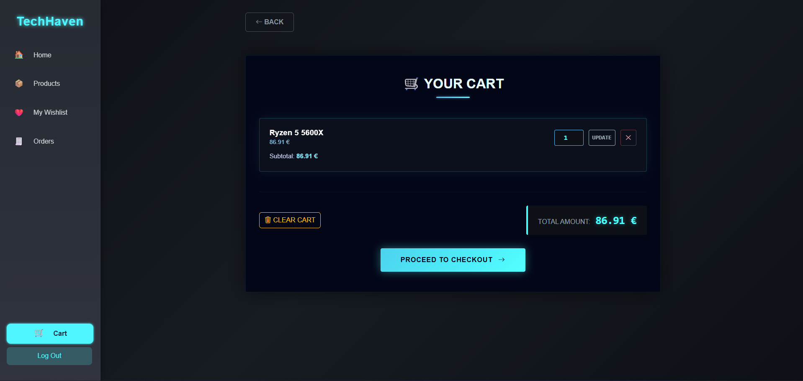

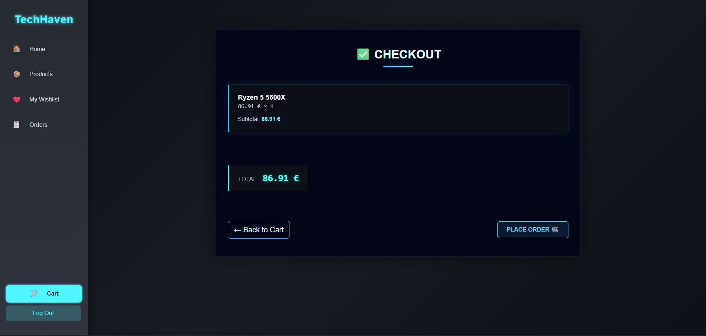

7. Manage your orders and track their status.


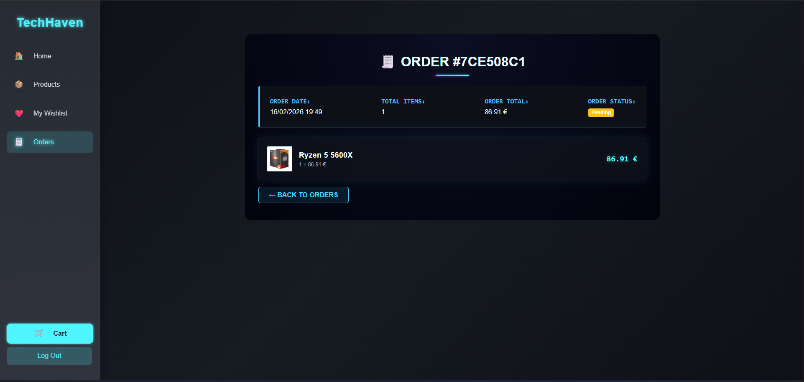

### Admin Site

1. Log Out of your user account by following button at the bottom left below 'Cart' and pressing 'Confirm' on the Logout page.

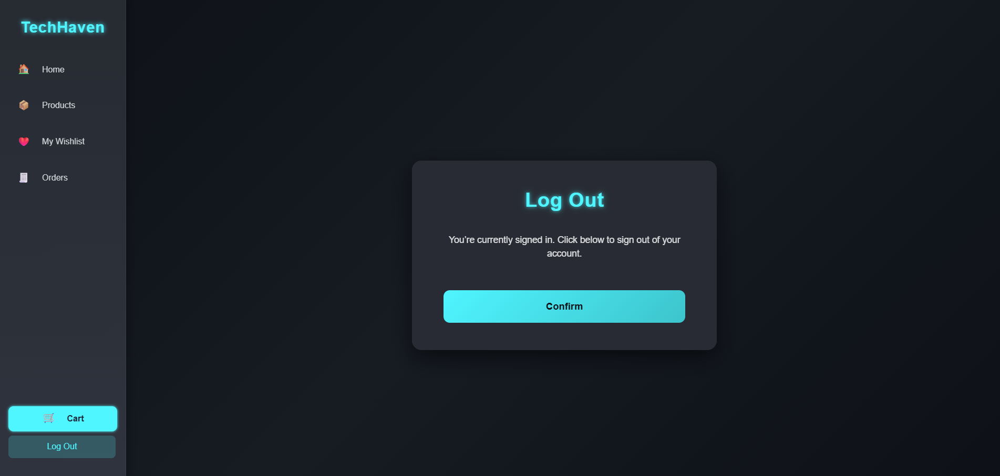

2. Navigate to the Login page via the button at the bottom left and log in with following credentials (defined in the admin seeder class):
   -- Email: admin@techhaven.com
   -- Password: Admin123!

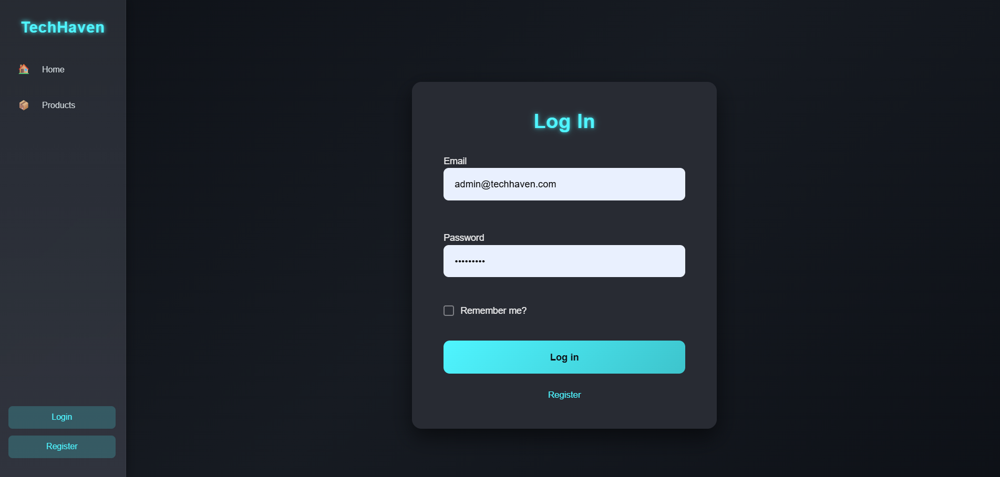

3. You can now view the Admin Dashboard where general metrics, recent orders and low stock products are displayed.

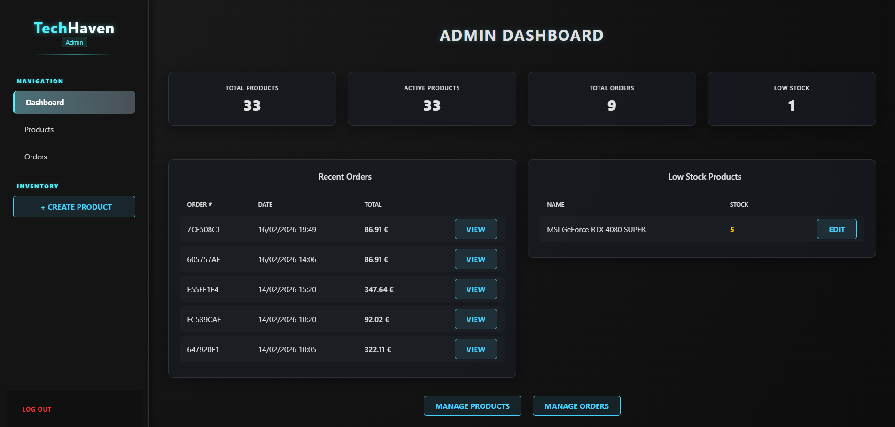

4. Follow the 'Products' navigation link on the left below 'Dashboard' to view the Products table where you can edit or toggle activation of any product.

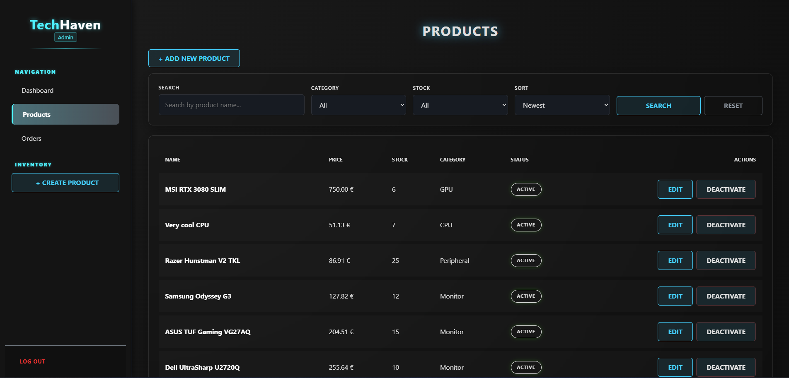

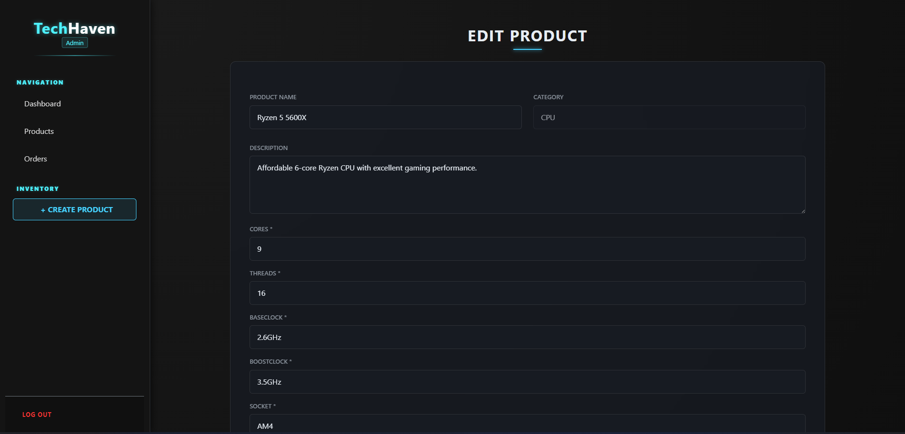

5. Follow the 'Create Product' button at the left under the 'Inventory' heading to add a new product. Specs are validated client-side (not strictly enforced by server).

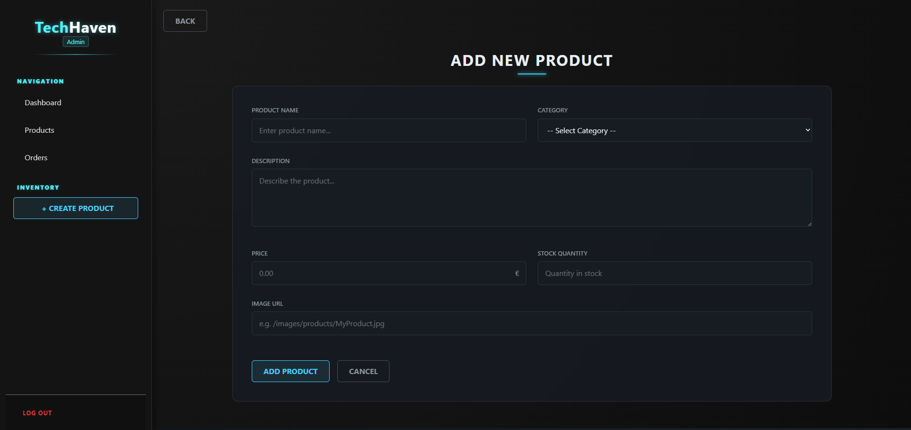

6. Follow the 'Orders' navigation link on the left below 'Products' to view the Orders table where you can view and update orders.

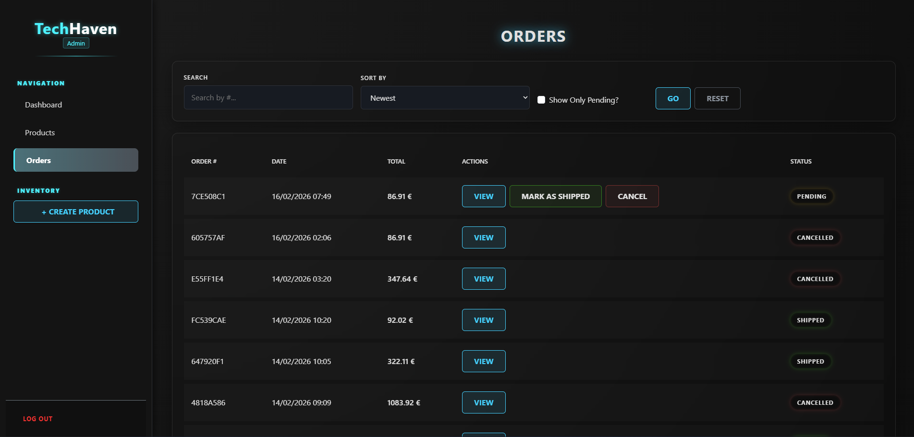

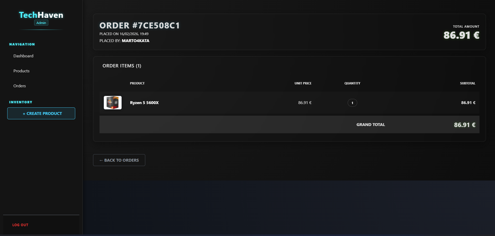

---

## 🗄️ Database Setup

TechHaven uses **Entity Framework Core** with a Code-First approach.

Connection string is configured in `appsettings.json` (change as needed):

```json
"ConnectionStrings": {
  "DefaultConnection": "Server=.;Database=TechHavenDb;Trusted_Connection=True;Encrypt=False;MultipleActiveResultSets=true"
}
```

To create and seed the database:

```bash
dotnet ef database update
```
// OR in Package Manager Console:

```bash
Update-Database
```

---

## ⚙️ Configuration

Key settings in `appsettings.json`:

```json
{
  "ConnectionStrings": {
    "DefaultConnection": "your-connection-string-here"
  },
  "Logging": {
    "LogLevel": {
      "Default": "Information"
    }
  }
}
```

---

## 🤝 Contributing

Contributions are welcome! To contribute:

1. Fork the repository
2. Create a new branch: `git checkout -b feature/your-feature-name`
3. Commit your changes: `git commit -m "Add some feature"`
4. Push to the branch: `git push origin feature/your-feature-name`
5. Open a Pull Request

---

## 📄 License

This project is licensed under the **MIT License**. See the [LICENSE](LICENSE.txt) file for details.

---

## 📬 Contact

Martin Terziev – [@mxrt0](https://github.com/mxrt0)

Project Link: [https://github.com/mxrt0/TechHaven](https://github.com/mxrt0/TechHaven)

---

